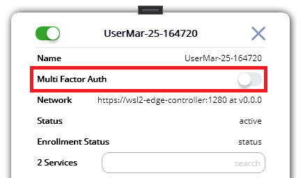
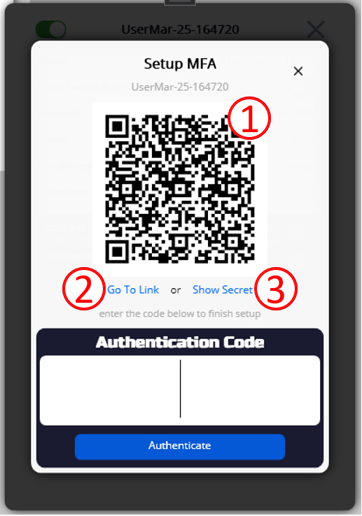
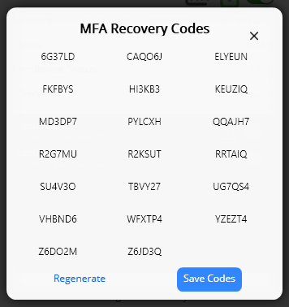
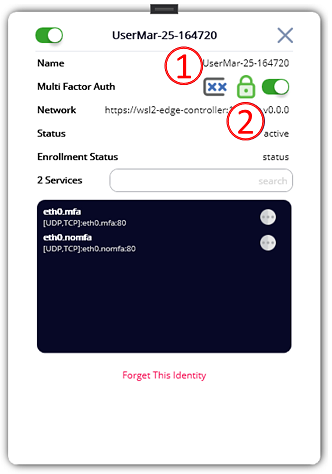
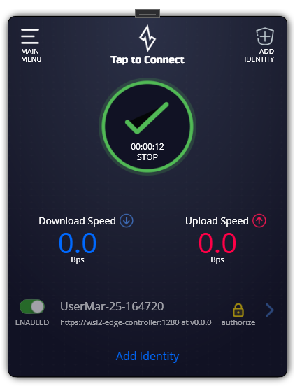
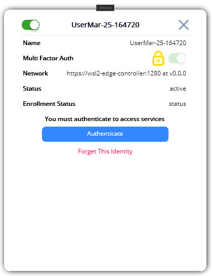

# MFA Functionality

## Enabling MFA

As of 1.9.0 the Zero Desktop Edge for Windows supports [Time-based One-time Passwords](https://en.wikipedia.org/wiki/Time-based_One-Time_Password) as a secondary form of authentication. Enabling MFA is straight forward and can be done by following the steps outlined below.

After enrolling an identity click on it and open the detail page. On the detail page click the toggle to enable mfa:

After toggling the toggle, a [QR Code](https://en.wikipedia.org/wiki/QR_code) will be generated and displayed and will look like:

1. Shows the [QR Code](https://en.wikipedia.org/wiki/QR_code). Use your mobile to scan the code into an authenticator application of your choice.
1. If a OTP-style application is installed and is mapped on the system to open links starting with `otpauth://`   
1. Show Secret will show you the secret that can be used to manually install the token into an authenticator app
1. Once the token is imported into the authenticator app - enter the 6-digit code into the "Authentication Code" field and click the button to enroll the identity for MFA.

### Post MFA Enrollment

After enrolling the identity it will be automatically authorized for the current session and recovery codes will be shown. Save these recovery codes as they will be needed in case the token is ever lost. 

Save the codes some place safe and close the screen. The detail screen will change and show two new icons:

1. The first icon will show the recovery codes for the identity if needed
1. The lock icon show the MFA status and represents if the identity has successfully been authorized. 

## Authenticating Using a Time-based One-time Token

After being enrolled should the session become invalid the lock icon will change to a yellow color and be shown on the main page. Click on the lock icon on either screen or click the "Authenticate" button on the detail page to initiate authentication.

A dialog will be shown. Enter the code code and complete authentication.

